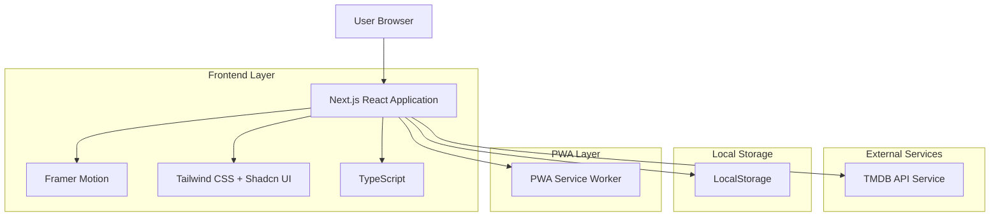
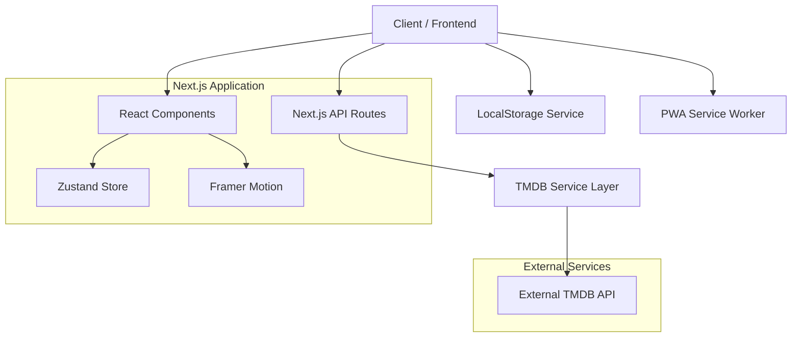
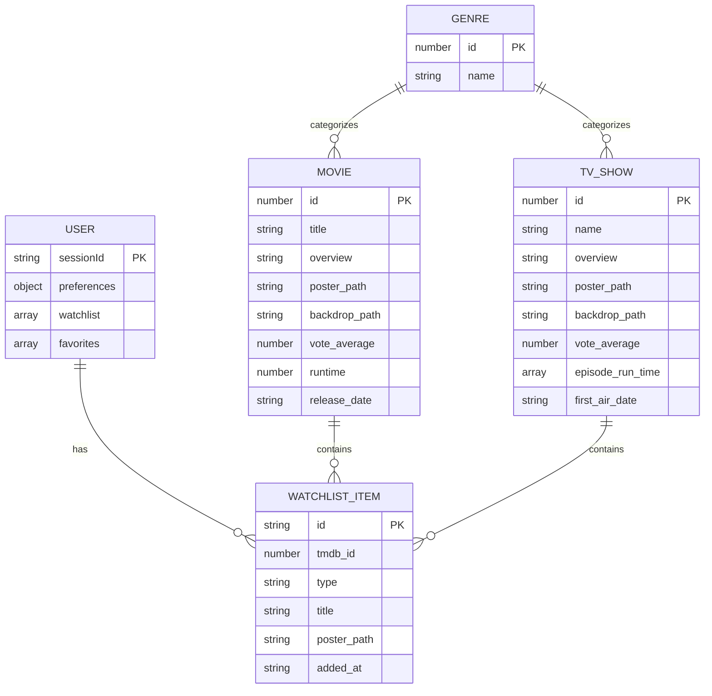

# REKO - Architecture Technique

## 1. Architecture design



## 2. Technology Description

* **Frontend**: Next.js + React + TypeScript

* **UI Framework**: TailwindCSS + Shadcn UI

* **Animations**: Framer Motion

* **PWA**: Next-PWA plugin

* **API Client**: Native Fetch API

* **State Management**: Zustand

* **Validation**: Zod

* **Package Manager**: PNPM

## 3. Route definitions

| Route        | Purpose                                                             |
| ------------ | ------------------------------------------------------------------- |
| /            | Landing page avec présentation REKO et CTA principal                |
| /explore     | Page d'exploration interactive avec flow Mood/Temps/Type            |
| /results     | Affichage des recommandations basées sur les sélections utilisateur |
| /movie/\[id] | Page détail d'un film spécifique avec informations complètes        |
| /tv/\[id]    | Page détail d'une série spécifique avec informations complètes      |
| /watchlist   | Gestion des favoris et watchlist de l'utilisateur                   |

## 4. API definitions

### 4.1 Core API

**TMDB API Integration**

```
GET /api/tmdb/discover/movie
```

Request:

| Param Name        | Param Type | isRequired | Description                                 |
| ----------------- | ---------- | ---------- | ------------------------------------------- |
| with\_genres      | string     | false      | IDs des genres séparés par virgule          |
| with\_runtime.gte | number     | false      | Durée minimale en minutes                   |
| with\_runtime.lte | number     | false      | Durée maximale en minutes                   |
| sort\_by          | string     | false      | Critère de tri (popularity.desc par défaut) |
| page              | number     | false      | Numéro de page pour pagination              |

Response:

| Param Name     | Param Type | Description                 |
| -------------- | ---------- | --------------------------- |
| results        | Movie\[]   | Liste des films recommandés |
| total\_pages   | number     | Nombre total de pages       |
| total\_results | number     | Nombre total de résultats   |

```
GET /api/tmdb/discover/tv
```

Request:

| Param Name        | Param Type | isRequired | Description                        |
| ----------------- | ---------- | ---------- | ---------------------------------- |
| with\_genres      | string     | false      | IDs des genres séparés par virgule |
| with\_runtime.gte | number     | false      | Durée minimale par épisode         |
| with\_runtime.lte | number     | false      | Durée maximale par épisode         |
| sort\_by          | string     | false      | Critère de tri                     |

```
GET /api/tmdb/movie/[id]
```

Response:

| Param Name     | Param Type | Description                 |
| -------------- | ---------- | --------------------------- |
| id             | number     | ID unique du film           |
| title          | string     | Titre du film               |
| overview       | string     | Synopsis                    |
| poster\_path   | string     | Chemin vers l'affiche       |
| backdrop\_path | string     | Chemin vers l'image de fond |
| vote\_average  | number     | Note moyenne TMDB           |
| runtime        | number     | Durée en minutes            |
| genres         | Genre\[]   | Liste des genres            |
| release\_date  | string     | Date de sortie              |

### 4.2 Types TypeScript

```typescript
interface Movie {
  id: number;
  title: string;
  overview: string;
  poster_path: string;
  backdrop_path: string;
  vote_average: number;
  runtime: number;
  genres: Genre[];
  release_date: string;
}

interface TVShow {
  id: number;
  name: string;
  overview: string;
  poster_path: string;
  backdrop_path: string;
  vote_average: number;
  episode_run_time: number[];
  genres: Genre[];
  first_air_date: string;
}

interface Genre {
  id: number;
  name: string;
}

interface UserPreferences {
  mood: string;
  timeAvailable: string;
  contentType: 'movie' | 'tv';
}

interface WatchlistItem {
  id: number;
  type: 'movie' | 'tv';
  title: string;
  poster_path: string;
  addedAt: string;
}
```

## 5. Server architecture diagram



## 6. Data model

### 6.1 Data model definition



### 6.2 Data Definition Language

**LocalStorage Schema**

```typescript
// Structure des données stockées localement
interface LocalStorageData {
  watchlist: WatchlistItem[];
  favorites: WatchlistItem[];
  userPreferences: {
    lastMood?: string;
    preferredGenres?: number[];
    viewingHistory?: number[];
  };
  appSettings: {
    theme?: 'light' | 'dark';
    language?: string;
    notifications?: boolean;
  };
}

// Clés LocalStorage utilisées
const STORAGE_KEYS = {
  WATCHLIST: 'reko_watchlist',
  FAVORITES: 'reko_favorites', 
  USER_PREFERENCES: 'reko_user_preferences',
  APP_SETTINGS: 'reko_app_settings'
} as const;

// Initialisation des données par défaut
const DEFAULT_STORAGE_DATA: LocalStorageData = {
  watchlist: [],
  favorites: [],
  userPreferences: {
    lastMood: undefined,
    preferredGenres: [],
    viewingHistory: []
  },
  appSettings: {
    theme: 'dark',
    language: 'fr',
    notifications: true
  }
};
```

**TMDB Genre Mapping**

```typescript
// Mapping des moods vers les genres TMDB
const MOOD_TO_GENRES = {
  comedy: [35], // Comedy
  thriller: [53], // Thriller  
  romance: [10749], // Romance
  action: [28], // Action
  relax: [16, 10751], // Animation, Family
  drama: [18], // Drama
  horror: [27], // Horror
  adventure: [12], // Adventure
  scifi: [878], // Science Fiction
  fantasy: [14] // Fantasy
} as const;

// Mapping des durées vers les filtres runtime
const TIME_TO_RUNTIME = {
  short: { gte: 0, lte: 30 }, // < 30 min
  medium: { gte: 30, lte: 60 }, // 30-60 min  
  long: { gte: 60, lte: 120 }, // 60-120 min
  extended: { gte: 120, lte: 300 } // > 120 min
} as const;
```

