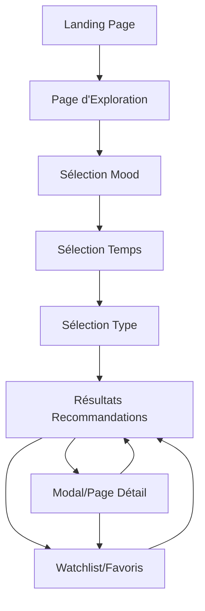

# REKO - Product Requirements Document

## 1. Product Overview

**REKO** est une web app moderne et ludique qui recommande des films et séries selon l'humeur, le temps libre et les préférences de l'utilisateur. L'objectif est de répondre à la question "Qu'est-ce que je regarde ce soir ?" de manière rapide et personnalisée.

L'application s'adresse aux cinéphiles et sériephiles qui perdent du temps à chercher quoi regarder, en proposant une expérience de sélection interactive et amusante basée sur leur état d'esprit du moment.

Le produit vise à devenir la référence pour les recommandations de contenu audiovisuel personnalisées, avec un potentiel d'expansion vers des fonctionnalités sociales et de découverte avancée.

## 2. Core Features

### 2.1 User Roles

Pas de distinction de rôles nécessaire pour le MVP - tous les utilisateurs ont accès aux mêmes fonctionnalités de base.

### 2.2 Feature Module

Notre application REKO se compose des pages principales suivantes :

1. **Landing Page** : section héro avec slogan impactant, présentation des fonctionnalités clés, call-to-action principal
2. **Page d'Exploration** : flow interactif en 3 étapes (Mood/Temps/Type), affichage des résultats en cartes, actions sur les recommandations
3. **Page/Modal Détail** : informations complètes du film/série, synopsis, note TMDB, actions utilisateur
4. **Watchlist/Favoris** : gestion des contenus sauvegardés, organisation personnelle

### 2.3 Page Details

| Page Name | Module Name | Feature description |
|-----------|-------------|---------------------|
| Landing Page | Section Héro | Afficher slogan accrocheur, animation d'entrée, design moderne et impactant |
| Landing Page | Présentation Fonctionnalités | Expliquer le concept Mood/Temps/Type, montrer les avantages de l'app, témoignages visuels |
| Landing Page | Call-to-Action | Bouton principal "Commencer à regarder", redirection vers exploration, micro-animations |
| Page d'Exploration | Sélection Mood | Présenter choix d'humeur (Comédie, Thriller, Romance, Action, Relax) via cartes visuelles interactives |
| Page d'Exploration | Sélection Temps | Proposer durées (<30min, 30-60min, 60-120min, >120min) avec icônes et animations |
| Page d'Exploration | Sélection Type | Choisir entre Film ou Série avec cartes illustrées et transitions fluides |
| Page d'Exploration | Affichage Résultats | Montrer recommandations en cartes (titre, affiche, durée, genre, plateforme), actions rapides |
| Page d'Exploration | Actions Cartes | Implémenter "Regarder maintenant", "Ajouter favoris", "Autre suggestion" avec feedback visuel |
| Page/Modal Détail | Informations Complètes | Afficher synopsis, note TMDB, casting, durée, genre, plateforme disponible |
| Page/Modal Détail | Actions Utilisateur | Gérer favoris/watchlist, partage, lien vers plateforme, fermeture modal |
| Watchlist/Favoris | Gestion Contenus | Lister films/séries sauvegardés, organiser par catégories, supprimer éléments |
| Watchlist/Favoris | Stockage Local | Sauvegarder données dans localStorage, synchronisation état, persistance sessions |

## 3. Core Process

**Flow Principal Utilisateur :**

L'utilisateur arrive sur la landing page, découvre le concept REKO et clique sur "Commencer à regarder". Il est dirigé vers la page d'exploration où il suit un parcours en 3 étapes : d'abord sélectionner son mood (humeur du moment), puis indiquer son temps libre disponible, et enfin choisir entre film ou série. 

Après validation, l'application affiche des recommandations personnalisées sous forme de cartes interactives. L'utilisateur peut alors consulter les détails d'un contenu, l'ajouter à ses favoris, ou demander une autre suggestion. Les contenus favoris sont sauvegardés localement et accessibles via la watchlist.

## 4. User Interface Design

### 4.1 Design Style

**Palette de couleurs :**
- Primaire : Violet moderne (#8B5CF6) pour les CTA et éléments importants
- Secondaire : Bleu nuit (#1E293B) pour les backgrounds et contrastes
- Accent : Orange chaleureux (#F97316) pour les interactions et highlights
- Neutre : Gris moderne (#64748B) pour les textes secondaires

**Style des composants :**
- Boutons : Style moderne avec coins arrondis (rounded-lg), effets de hover et transitions fluides
- Cartes : Design glassmorphism avec ombres douces et bordures subtiles
- Typography : Inter ou Poppins pour la lisibilité, tailles hiérarchisées (text-4xl pour titres, text-base pour contenu)

**Layout et animations :**
- Layout : Design card-based avec grille responsive, navigation top moderne
- Animations : Transitions Framer Motion pour les changements d'état, micro-interactions sur hover/click
- Icônes : Style outline moderne (Heroicons ou Lucide), cohérence visuelle

### 4.2 Page Design Overview

| Page Name | Module Name | UI Elements |
|-----------|-------------|-------------|
| Landing Page | Section Héro | Background gradient violet-bleu, titre en text-5xl bold, sous-titre en text-xl, bouton CTA orange avec animation pulse |
| Landing Page | Présentation | Grille 3 colonnes responsive, cartes avec icônes colorées, texte centré, animations d'apparition au scroll |
| Page d'Exploration | Sélection Mood | Grille de cartes 2x3 sur desktop, 1x6 sur mobile, couleurs thématiques par mood, hover effects avec scale |
| Page d'Exploration | Sélection Temps | Cartes horizontales avec icônes horloge, progression visuelle, couleurs dégradées selon durée |
| Page d'Exploration | Résultats | Grille responsive 3-2-1 colonnes, cartes avec image poster, overlay gradient, boutons d'action flottants |
| Modal Détail | Contenu Principal | Layout split-screen desktop, stack mobile, image poster fixe, contenu scrollable, backdrop blur |
| Watchlist | Liste Contenus | Layout liste avec miniatures, informations condensées, actions rapides, filtres par catégorie |

### 4.3 Responsiveness

L'application est conçue **mobile-first** avec adaptation progressive vers desktop. Optimisation tactile complète pour les interactions mobile (touch targets 44px minimum, swipe gestures). Breakpoints : mobile (<768px), tablet (768-1024px), desktop (>1024px). Navigation adaptative avec menu hamburger sur mobile et navigation horizontale sur desktop.